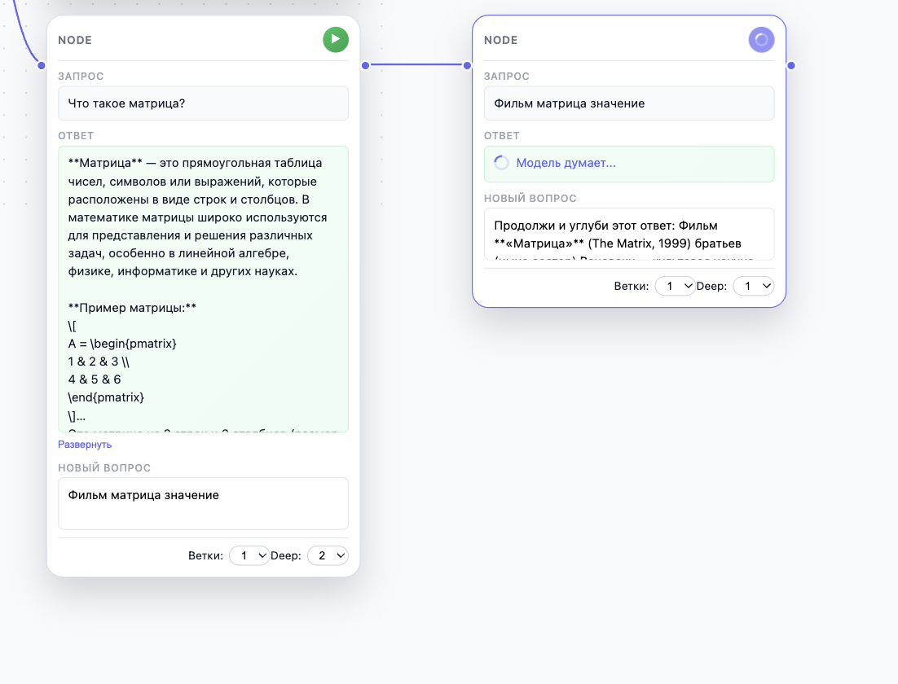

# Развитие проекта Tension (Enterprise Roadmap)

## Цель
Трансформация Tension в лидирующий Enterprise-инструмент для моделирования и исследования диалогов с использованием LLM. Фокус на безупречном UX, масштабируемости, безопасности и эстетике.

## Текущий статус: Stage 3.5 (Enterprise Refactoring & Polish)

### Выполнено (Core & MVP)
- **Tech Stack:** Vite + React + TypeScript, FSD Архитектура.
- **Canvas Core:** Бесконечный холст, зум, панорамирование, drag-and-drop нод.
- **Node System:**
  - Создание, удаление, редактирование нод.
  - Ветвление (1-4 ветки).
  - Рекурсивная генерация (Deep Level 1-4).
  - Интеграция OpenAI (реальные запросы).
- **Persistence:** IndexedDB (сохранение графа, настроек, чатов).
- **Multi-Chat:** Управление множеством диалогов, переключение без потери данных.
- **UX Enhancements:**
  - Command Palette (Cmd+K).
  - Context Menu (Right Click).
  - Custom UI Components (Select, Icons instead of Emojis).
  - "Fit to View" (Центрирование).
  - Индикаторы сохранения и загрузки.

### В работе (Enterprise Audit)
- **UI/UX Polish:**
  - [x] Замена эмодзи на SVG иконки (Lucide style).
  - [x] Кастомные селекты вместо нативных.
  - [ ] Улучшение визуализации связей (Smart Routing).
  - [ ] Анимации появления нод и связей.
- **Code Quality:**
  - [ ] Рефакторинг `useWorkspaceModel` (разделение ответственности).
  - [ ] Строгая типизация всех событий.
  - [ ] Оптимизация рендеринга (React.memo, useMemo).

## План развития (Roadmap)

### Q4 2024: Pro Features
- [ ] **Minimap:** Навигация по большому графу.
- [ ] **History:** Undo/Redo (Zustand/Redux middleware).
- [ ] **Export/Import:** Продвинутый экспорт в JSON/PDF/PNG.
- [ ] **Node Types:**
  - *Text Node* (просто текст).
  - *Image Node* (генерация изображений).
  - *Logic Node* (условия if/else).

### Q1 2025: Collaboration & Cloud
- [ ] **Backend:** NestJS/Go сервис для синхронизации.
- [ ] **Real-time:** WebSockets (Yjs) для совместной работы.
- [ ] **Auth:** Clerk/Auth0 интеграция.
- [ ] **Team Workspaces:** Разделение проектов по командам.

### Q2 2025: AI Autonomy
- [ ] **Auto-Layout:** AI-организация графа.
- [ ] **Smart Suggestions:** Предиктивное создание нод.
- [ ] **Vector Search:** Поиск по смыслу в истории диалогов.

## Принципы разработки (Ideology)
См. файл `IDEOLOGY.md` для детального описания философии проекта.
1. **Zero Latency:** Интерфейс должен летать.
2. **Infinite Scale:** Граф может быть любого размера.
3. **Data Ownership:** Данные пользователя принадлежат пользователю (Local-First).
